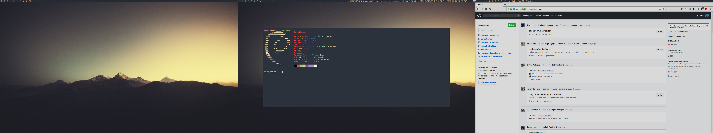

# dwm - dynamic window manager
dwm is an extremely fast, small, and dynamic window manager for X.



## Requirements
In order to build dwm you need the Xlib header files. These can be installed on
debian based systems with
```
sudo apt install libx11-dev
```

## Installation
```
make clean install
```

## Running dwm
Add the following line to your .xinitrc to start dwm using startx:
```
exec dwm
```

## Deus
Deus is a theme from [vim-deus](https://github.com/ajmwagar/vim-deus) created
out of sheer rage. I'm really enjoying this theme.

I have also riced the [st-deus](https://github.com/DevonMorris/st-deus) to match
this window manager.
